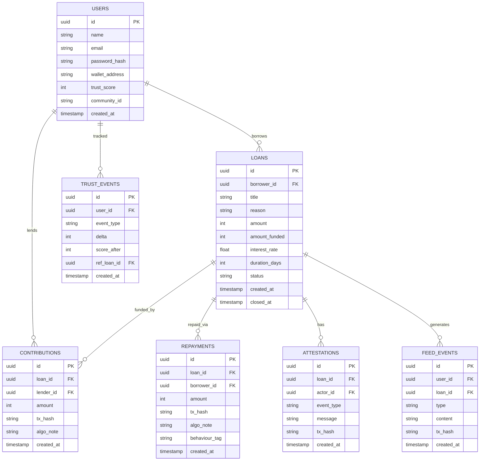
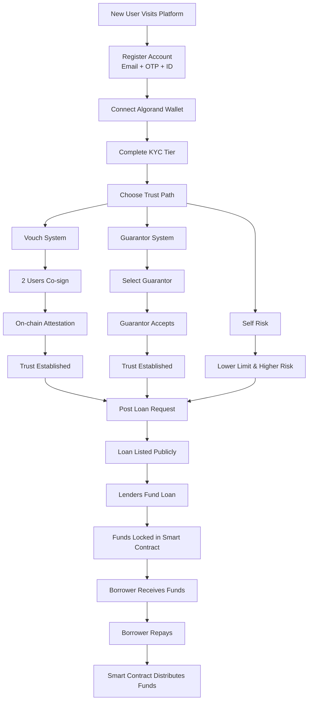

# parity_squad
1. Smit Bangar
2. Krishna Lagad
3. Sarvesh Joshi
4. Jui Deshmukh

# 🏦 Lendpool
### A Community-Driven, Trust-Based Peer-to-Peer Lending Platform on Algorand  

---

## 🚀 Overview

**Lendpool** is a decentralized peer-to-peer lending platform that transforms informal community lending into a **transparent, secure, and trust-driven digital system**.

It combines:

- 🔗 Blockchain transparency (Algorand)
- 🧑‍🤝‍🧑 Community-driven trust
- 📊 Behavior-based reputation
- 🪙 On-chain loan execution

👉 to solve the real-world problem of unstructured lending in small communities.

---

## ❗ Problem Statement

In informal lending systems (WhatsApp groups, friend circles, chit funds):

- ❌ No proper tracking of loans  
- ❌ No clarity on repayments  
- ❌ No accountability  
- ❌ High chances of disputes  

👉 Result: **Loss of trust + financial inefficiency**

---

## 💡 Solution

Lendpool introduces a **trust-first decentralized lending ecosystem** where:

- Loans are posted, funded, and repaid transparently  
- Trust is established using:
  - Verification tiers  
- Community vouching  
  - Guarantor system  
- All transactions are recorded on the **Algorand blockchain**

---

## 🧠 System Architecture

### 📊 Database Schema (ER Diagram)



---

### 🔗 Blockchain-Centric Design

- Lenders fund loans via wallet transactions  
- Funds are stored in a **smart contract escrow**  
- Borrower receives funds only after full funding  
- Repayments:
  - Sent to smart contract  
  - Distributed **pro-rata** to lenders  

---

## ⚙️ Core Flow

```
Lender → Funds Loan → Smart Contract (Escrow)
        ↓
Borrower receives funds
        ↓
Borrower repays
        ↓
Smart contract distributes repayment to lenders
```

---

## 🔍 Transparency Layer

All transactions are:

- Stored on-chain  
- Queryable via Algorand Indexer  
- Verifiable via blockchain explorer  

✅ No hidden actions  
✅ No manipulation  
✅ Full auditability  

---

## 🧑‍推 User Flow

### 🔄 System Flow Diagram



---

## 🪪 Trust & Verification System

### 🔥 Multi-Tier Identity Model

| Tier | Verification       | Blockchain Mechanism | Loan Limit |
|------|------------------|---------------------|-----------|
| 0    | Wallet only       | Wallet identity     | Minimal   |
| 1    | Email OTP         | Basic identity      | Low       |
| 2    | Mobile OTP        | Linked identity     | Medium    |
| 3    | Govt ID (hashed)  | On-chain hash       | High      |
| 4    | Community Vouch   | Multisig approval   | Very High |

---

### 🔐 Key Innovation

- Identity linked to wallet  
- Govt ID stored as **SHA-256 hash** on-chain  
- Vouching uses **multisignature transactions**  

👉 Ensures:

- Privacy ✅  
- Authenticity ✅  
- Tamper-proof verification ✅  

---

## 🔗 Blockchain Features

- Smart contract escrow for loans  
- ASA badges for tiers  
- Multisig approvals for vouching  
- On-chain reputation tracking  
- Immutable transaction history  

---

## 🧠 Reputation System

Tracks:

- Borrower score  
- Lender behavior  
- Repayment consistency  

Stored as:

- On-chain state  
- Trust receipts  

👉 Creates a **transparent trust graph**

---

## 💥 Key Innovations

### ⭐ Trust-Based Lending
No collateral required — trust replaces assets  

### ⭐ Guarantor Model
Social accountability replaces legal enforcement  

### ⭐ On-Chain Reputation
Transparent + immutable trust score  

### ⭐ Multi-Path Trust Entry
Flexible onboarding system  

### ⭐ Automated Repayment Distribution
Smart contract handles all payouts  

### ⭐ No Intermediaries
Fully peer-to-peer  

---

## 🏆 What Lendpool Does Differently

| Feature            | Traditional Apps             | Lendpool                            |
|------------------|-----------------------------|--------------------------------------|
| Trust Model       | Credit score / documents     | Community + behavior + blockchain    |
| Transparency      | Limited                     | Fully on-chain                       |
| Intermediary      | Required                    | None                                 |
| Loan Distribution | Platform-controlled         | Smart contract escrow                |
| Repayment         | Manual                      | Automated pro-rata                   |
| Identity          | Centralized KYC             | Decentralized + hashed               |
| Enforcement       | Legal                       | Social + reputational                |

---

## 💡 Core Differentiator

> **Lendpool transforms informal trust into a verifiable, on-chain financial system.**

---

## ⚙️ Tech Stack

- Blockchain: Algorand  
- Smart Contracts: Algorand Python (algopy)  
- Backend: Python (FastAPI)  
- Frontend: React.js (Vite)  
- Wallet: Pera Wallet  

---

## 🛠️ Getting Started

### Prerequisites

- [Docker](https://www.docker.com/)
- [AlgoKit](https://github.com/algorandfoundation/algokit-cli)
- Python 3.12+
- Node.js v22+

### Setup

1. **Bootstrap the project:**
   ```bash
   algokit project bootstrap all
   ```

2. **Start LocalNet:**
   ```bash
   algokit localnet start
   ```

3. **Build and Deploy Smart Contracts:**
   ```bash
   algokit project run build
   # Note: Deployment is configured via smart_contracts/loan_contract/deploy_config.py
   python -m smart_contracts deploy
   ```

4. **Run Frontend:**
   ```bash
   cd frontend
   npm install
   npm run dev
   ```

---

## 📦 Future Enhancements

- AI-based risk prediction  
- Behavioral credit scoring  
- Cross-community lending  
- Mobile app  
- Decentralized identity (DID)  

---

## 📜 License

MIT License

---

## 🙌 Acknowledgment

Built to enable **trust-driven decentralized finance for real communities**

